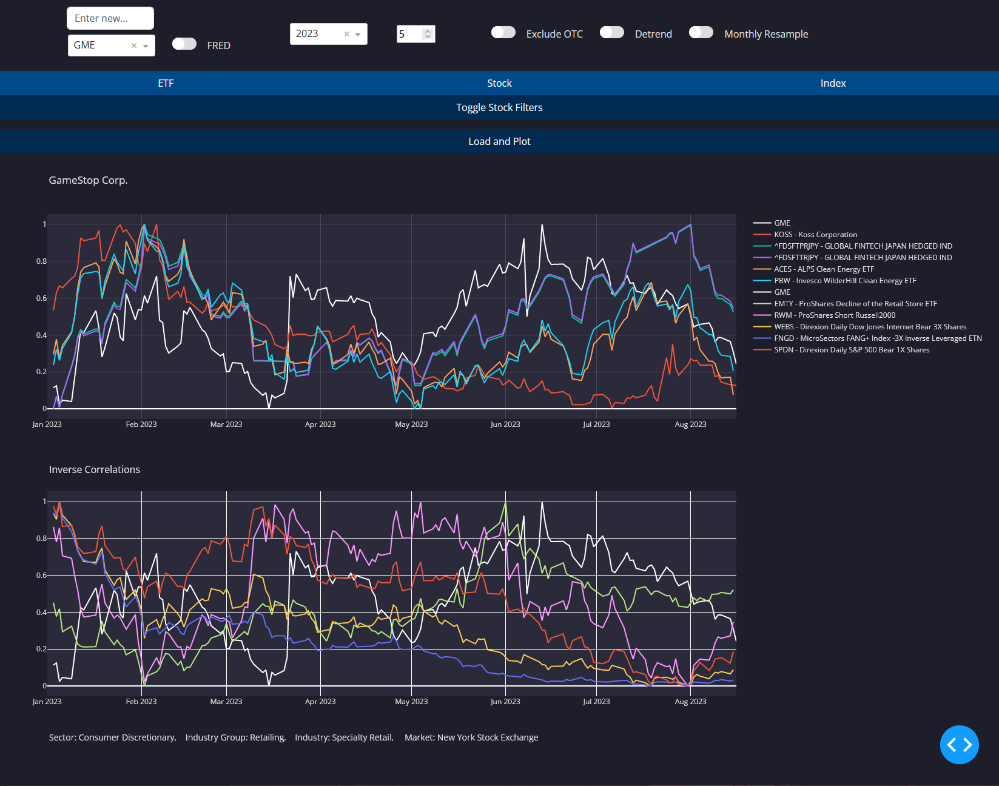
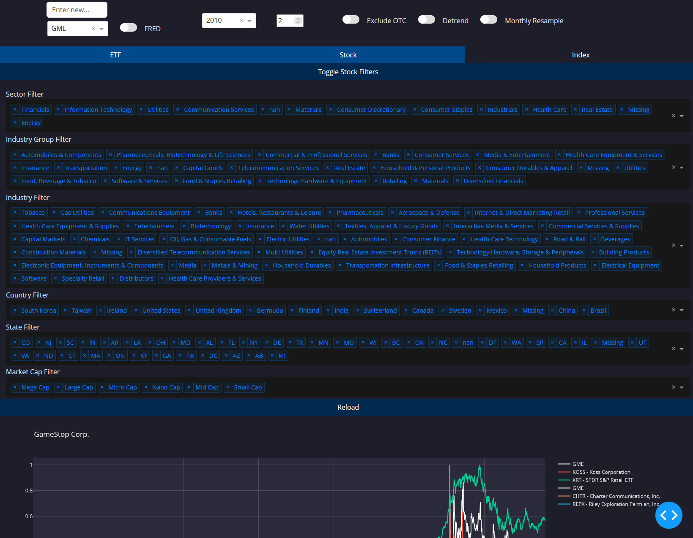
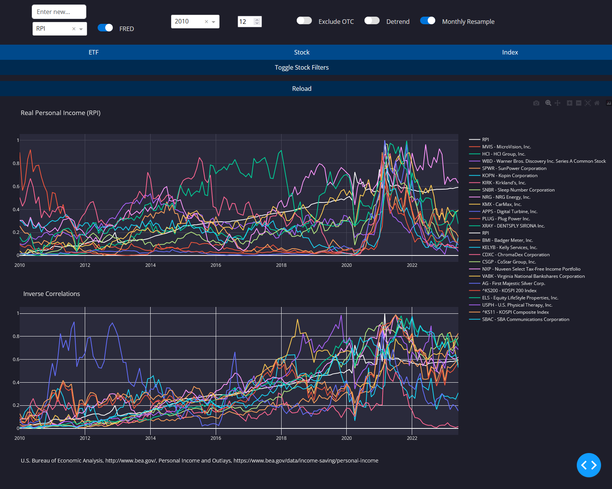

# SecuritiesCorrelations
The SecuritiesCorrelations project is a tool that provides insights into the correlations between different securities. The project offers interactive visualizations and analysis of securities' relationships, helping users understand market dynamics.

## Main Features:
1. Interactive Dashboard: The main_ui.py script provides an interactive dashboard built with Dash, allowing users to visualize correlations between securities.

2. Data Integration: The project integrates data from multiple sources, including FRED, FinDB, and Yahoo daily stock data.

3. Filtering Capabilities: Users can apply various filters to narrow down their analysis, such as ETF, Stock, Index, and more.

4. Customizable Plots: The tool provides the ability to detrend data, resample on a monthly basis, and exclude OTC data for a more refined analysis.

5. Advanced Correlation Analysis: The scripts directory contains various Python scripts to compute correlations, read files, and plot data.
    
## Setup
The 'mini' branch will run on its own, but it is a limited version that only considers about 100 securities, mainly stocks. 

For the 'main' branch you need to download a folder with 2gb of parquets from https://drive.google.com/drive/folders/1W8n0o0Nrj4bJgsXEk1uneZqqyqk0bJfP?usp=drive_link and place it in the data/yahoo_daily/ folder so that every Stock, ETF, and Index has data.   

## Running the Dashboard:
To launch the interactive dashboard, navigate to the root directory of the project and run:

python main_ui.py
This will start the Dash server and the dashboard will be accessible in your browser at localhost:8080. 

First time calculations will take a minute, but subsequent calculations will only take a few seconds due to caching data retrieval. Once a calculation is made it should be saved to data/Graphs/pickled_security_correlations/.
Entering a ticker into the top "Enter New..." box will always calculate the correlation from scratch. You can also do this by clicking "Reload"  

FRED button makes the dropdown show different macroeconomic indicators form the FRED-MD dataset that can be selected from.

The year button will adjust from which starting point the correlation calculation begins. 

The input next to the year is the number of stocks to include in the plot.

'Exclude OTC' will exclude Pink Sheet Stocks.

'Detrend' will show the data as detrended (it is always calculated as detrended) so the user can get a better visualization of the correlation.

'Monthly Resample' will show the data resampled into monthly granularity, mainly to help with visualizing FRED-MD data which is only available monthly anyways.

Stock Filters is a list of filters that will only apply to stocks. Metadata is taken from FinanceDB, which has accurate information for the majority of stocks but occasionally has "Missing" or "nan" values.

### Tips:
Click on a security in the legend to hide it from the graph.

Modifying the plot using anything other than the filter options will reset the filters.

## Future Enhancements:
Integrate more data sources to provide a comprehensive analysis.

Be able to calculate correlations for more recent timeframes, e.g. for the  last month using 15-minute resolution data.

Add anomaly detection.

Introduce machine learning models to identify potential market anomalies.
## Contributing:
Feel free to fork the repository and submit pull requests for any enhancements or bug fixes. We appreciate your contribution!

## License:
This project is open source and available under the GNU General Public License.

